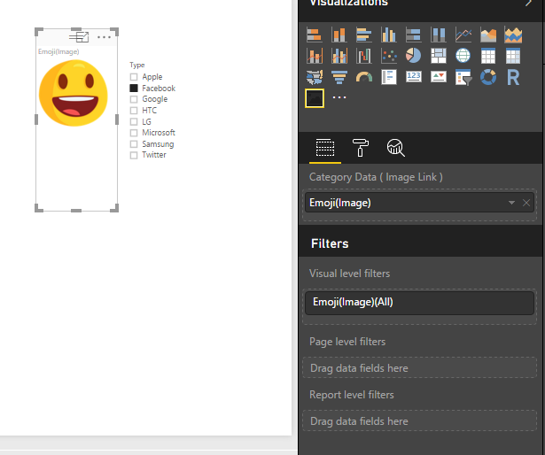

# PowerBI-visuals-Dynamic Image 
Custom Visual for Power BI to create Dynamic Image based on the filters.

Follow the steps in the [link](https://github.com/Microsoft/PowerBI-visuals) for more details.

----------

## To customize  
Once you have cloned this example, run these commands to [install dependencies](https://github.com/Microsoft/PowerBI-visuals#setting-up-environment) and to connect the visual in powerbi service
```
npm i

pbiviz start -- To start the localhost server
pbiviz package - To create a packaged file
```
----------

## To import the visual 

* Check out the dist folder for packaged file which you can directly import

----------
## Limitations

* Shows only one Image, if the filters applied returns multiple images , Then this visual (current version) will not work  :(

----------

## RoadMap
* Ability to provide/modify image width/height for each image
* Addding static parametets to the Image Links to facilitate signed urls
* Multi Image slider like Friend Suggestions in Facebook 
* Few more things !!



## [Sample File](sample/Emoji.xlsx)

| Type   |      Emoji(Image)
|----------|:-------------:|
|Apple|https://powerbi-visuals.s3.amazonaws.com/images/Apple.png              |
|Google|https://powerbi-visuals.s3.amazonaws.com/images/Google.png            |
|Microsoft|https://powerbi-visuals.s3.amazonaws.com/images/Microsoft.png      |
|Samsung|https://powerbi-visuals.s3.amazonaws.com/images/Samsung.png          |
|LG|https://powerbi-visuals.s3.amazonaws.com/images/LG.png                    |
|HTC|https://powerbi-visuals.s3.amazonaws.com/images/HTC.png                  |
|Facebook|https://powerbi-visuals.s3.amazonaws.com/images/Facebook.png        |
|Twitter|https://powerbi-visuals.s3.amazonaws.com/images/Twitter.png          |
